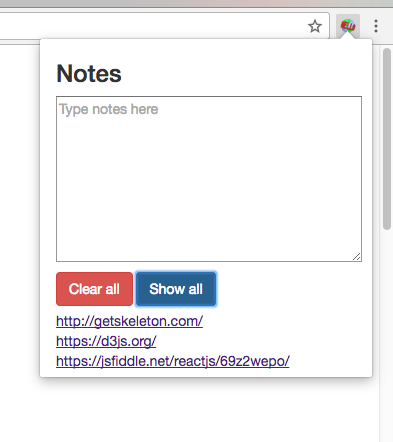

# Chrome Notes Extension
A demo Chrome extension for a Terrapin Hackers Hacktorial

### Summary
Write notes on a webpage. If you come back to the page later, your notes will still be there.
* Clear all: remove notes from all pages
* Show all: show the urls for every page with notes

### Tutorial
Follow [our tutorial](INSTRUCTIONS.md#chrome-notes-extension) to create the demo project yourself.

### Contributors
Johann Miller and Omkar Konaraddi
